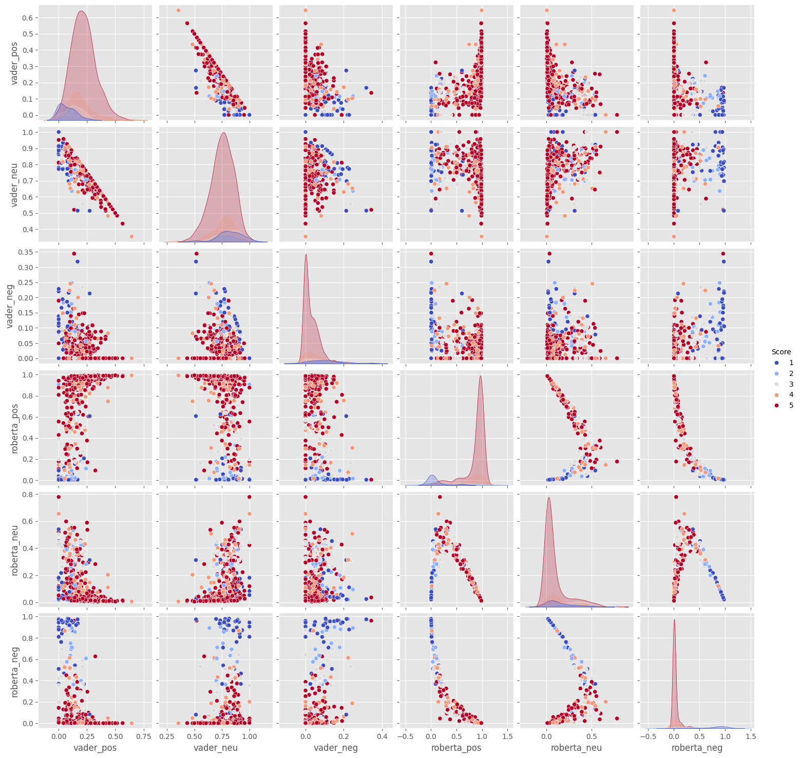

# Sentiment Analysis

## Overview
This project explores sentiment analysis using product reviews. The dataset contains textual reviews and corresponding star ratings (1-5). The goal is to compare traditional sentiment analysis methods with modern deep learning approaches to better understand how sentiment scores relate to star ratings.

## Key Features
1. **Exploratory Data Analysis (EDA)**:
   - Analyzed star rating distribution with histograms.
   - Visualized relationships between sentiment scores and star ratings.

2. **Sentiment Analysis**:
   - Used VADER (Valence Aware Dictionary and sEntiment Reasoner) from the `nltk` library to calculate polarity scores (positive, neutral, negative, compound).
   - Merged sentiment scores into the original dataset for analysis.

3. **Model Comparison**:
   - Employed a pretrained RoBERTa model from Hugging Face for fine-grained sentiment analysis.
   - Compared RoBERTa's performance with VADER using visualizations like bar plots and pairplots.

4. **Fast Implementation for Businesses**:
   - Implemented a streamlined solution using Hugging Face's transformers pipeline, catering to businesses that require quick and efficient sentiment analysis.

## Dataset
- **Source**: [Amazon reviews dataset on Kaggle](https://www.kaggle.com/code/robikscube/sentiment-analysis-python-youtube-tutorial/input?select=Reviews.csv)
- **Features**:
  - `review_text`: Text of the review.
  - `star_rating`: Rating on a scale of 1-5.

## Workflow
1. **Data Preprocessing**:
   - Tokenized review texts using `nltk`.
   - Calculated VADER sentiment scores and merged them with the dataset.

2. **EDA and Visualization**:
   - Bar plots to analyze compound scores with respect to star ratings.
   - Separate visualizations for positive, neutral, and negative scores by rating.

3. **Modeling**:
   - Used a pretrained RoBERTa model for sentiment classification.
   - Visualized and compared results from RoBERTa and VADER.
   - Added insights on the potential of the BERT family of models (including RoBERTa) for capturing contextual nuances in text, making them particularly suited for fine-grained sentiment tasks.

4. **Fast Implementation**:
   - Utilized Hugging Face’s sentiment analysis pipeline to demonstrate a fast and efficient solution for real-world applications.

## Results
- RoBERTa was clearly the better-performing model compared to VADER. The results demonstrated that RoBERTa's predictions were more consistent and confident, as shown by the sharper distribution of sentiment scores in the visualizations.
- In contrast, VADER exhibited more variance within its score distributions, indicating a less decisive sentiment classification.
- Pairplot analysis further illustrated the differences, showing how RoBERTa's predictions align more closely with expected star ratings compared to VADER.

## Tools and Libraries
- Python
- `nltk`
- `matplotlib`, `seaborn`
- `transformers`
- `pandas`, `numpy`
- `tqdm`, `scipy`

## Future Improvements
- Fine-tune the RoBERTa model on the Amazon reviews dataset for better performance.
- Explore other sentiment analysis models, such as BERT and GPT-based models.
- Train a model on reviews instead of using a pretrained model.

## Acknowledgments
- This is my first attempt at working with Natural Language Processing (NLP), and I have drawn inspiration from multiple sources to learn and build this project.
- The Kaggle tutorial by [Rob Mulla](https://www.kaggle.com/code/robikscube/sentiment-analysis-python-youtube-tutorial) provided valuable guidance for structuring the workflow and implementing key concepts.
- [Hugging Face](https://huggingface.co/) for providing pretrained models and pipelines.
- [nltk](https://www.nltk.org/) for sentiment analysis tools.
- The contributors of the [Amazon reviews dataset](https://www.kaggle.com/code/robikscube/sentiment-analysis-python-youtube-tutorial/input?select=Reviews.csv).

